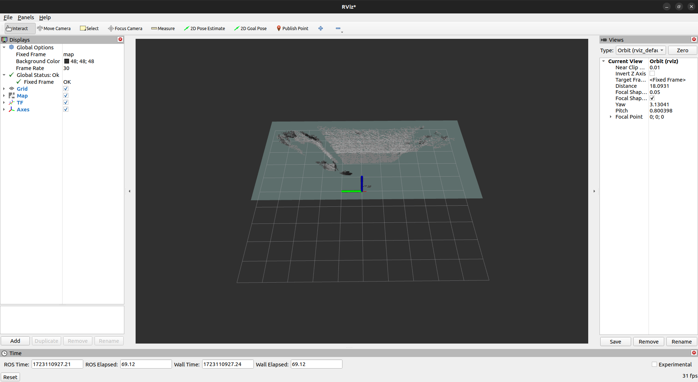

# Realsense ROS2 guide

## Realsense Node
<details>
  <summary>
    Parameters
  </summary>

- #### run realsense node
    
    ```bash
    $ ros2 run realsense2_camera realsense2_camera_node
    ```
- #### Parameters

    ```
    $ ros2 node list #(Output: /camera)
    $ ros2 param list /camera

    ```
- #### Get parameters

    ```bash
    $ ros2 param get /camera #(Output: Boolean value is: True)
    ```

- #### Set parameters

    ```bash
    ros2 param set /camera pointcloud.enable true
    ```
</details>

## SLAM using RTAB-Map
<details>
  <summary>
    RTAB-Map Installation
  </summary>

- #### Install RTAB-Map

    ```bash
    $ sudo apt-get install ros-humble-rtabmap-ros
    ```
- ####  Launch Realsense

    ```bash
    $ ros2 launch realsense2_camera rs_launch.py align_depth.enable:=true
    ```

- #### Launch RTAB-Map

    ```bash
    $ ros2 launch rtabmap_examples realsense_d400.launch.py
    ```

- #### Config Rviz2
  - click on the "Add" button 
  - select "By topic"
  - select "map"



- #### Reference
  - [RTAB-Map ROS](https://github.com/introlab/rtabmap_ros/tree/humble-devel)

